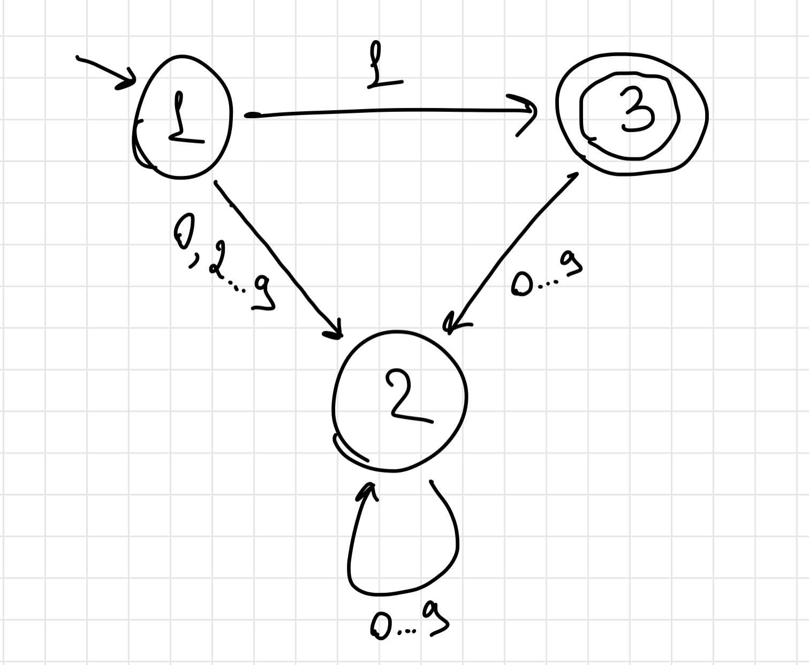

# Описание мое языка для ДКА
### Специальные символы языка 
`->, \, запятая, многоточие, двоеточие, тире`

`->` - используется для обозначения ребра между вершинами. Пример: `1 -> 2`

`\` - используется для разделения двух обозначений. Ставим `\`, затем перенос строки. То есть если мы хотим задать 2 ребра, это будет выглядеть так:
```
1 -> 2 \
2 -> 3 \
```

`запятая (,)` - используется для перечисления символов перехода. То есть если по ребру можно перейти, используя символы `1`, `2`, `3`, в языке можно будет писать их через запятую: `1, 2, 3`

`двоеточие (:)` - ставится после обозначения ребра, после двоеточия идет описание переходов по этому ребру. То есть описание ребра из вершины 1 в вершину 2 по символам `1`, `2`, `3` будет выглядеть следующим образом: `1 -> 2 : 1, 2, 3 \`. В этом примере можно видеть все описанные выше специальные символы.

`многоточие (...)` - используется для быстрого перечисления символов перехода. Если ребро из вершины 1 в вершину 2 содержит символы перехода `1`, `2`, `3`, `4`, то можно записать это следующим образом: `1 -> 2 : 1...4 \` (вместо `1 -> 2 : 1, 2, 3, 4 \`). Также можно использовать комбинации `,` и `...`, например `1 -> 2 : 1, 5...9 \`

`тире (-)` - используется для описания типа вершины
#### Типы вершины
Для обозначения типа вершины используются цифры `0, 1, 2, 3`
```
0 - начальная вершина
1 - обычная вершина
2 - сток
3 - терминальная вершина
```
Нумерация самих вершин начинается с 1, то есть `1, 2, ..., n`

Если мы хотим показать, что вершина 1 является начальной, мы используем `тире (-)`: `1 - 0`

#### Описание ребра
Выглядит следующим образом: `1 -> 2 : 1, 2, 3 \`

Эта запись задает ребро из вершины 1 в вершину 2 по меткам переходов `1`, `2`, `3`. В конце стоит `\`, который показывает, что описание ребра закончилось

### Про метки переходов
Если метки переходов содержат символы `char`, то их надо заключать в кавычки, при этом экранируя символы `"` (`\"`) и `\`(`\\`). То есть если наш автомат содержит, к примеру, переходы
```
дед мороз
"
\
```
В языке это будет описано следующим образом
```
1 -> 2 : "дед мороз", "\"", "\\" \ 

(ребро 1 -> 2 взято для наглядности примера)
```
Это сделано для того, чтобы лексер однозначно понимал, когда перед ним [специальный символ](), а когда символьная последовательность (для нее используется токен `STR`)

Если метка перехода представляет собой число, кавычки ставить не нужно - для таких случаев используется токен `NUM`
```
1 -> 2 : 1, 2, 5 \
```

### Полная запись на языке
Каждое новое обозначение начинается с новой строчки и заканчивается `\`

В самом начале пишется количество вершин

После этого идет описание всех вершин, то есть описание их [типа]()

После этого начинается [описание ребер]()

Рассмотрим запись конкретного автомата

### Пример
Определить, дали на вход 1 или что-то другое

Запись на нашем языке выглядит следующим образом
```
3 \                     #задаем количество вершин
1 - 0 \                 #задаем типы вершин
2 - 2 \                 #задаем типы вершин
3 - 3 \                 #задаем типы вершин
1 -> 3 : 1 \            #описание ребер
1 -> 2 : 0, 2...9 \     #описание ребер
2 -> 2 : 0...9 \        #описание ребер
3 -> 2 : 0...9 \        #описание ребер
```
После `#` стоят комментарии для пояснения описания. В самом языке они не используются